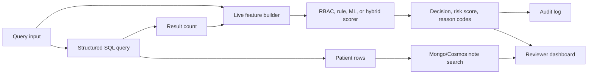

# Architecture

## Purpose

The project demonstrates a practical EHR access-risk triage workflow. It scores
live or synthetic access events, explains the factors behind each score, and
ranks events for review under constrained audit capacity.

## Data Flow



## Core Components

`app_logic.py` coordinates the live query path. It gathers query inputs, runs the
structured patient lookup, builds risk features, scores the event, logs the
decision, and returns any allowed patient and note results.

`risk_engine.py` contains the transparent rule layer. Each rule contributes a
weighted reason code, which keeps the model output explainable for reviewers.

`baselines.py` normalizes the scoring modes used across the app and benchmark:
RBAC, rules, ML-only, hybrid, and k-anonymity.

`benchmark_generator.py` creates deterministic synthetic patients, encounters,
users, care-team relationships, notes, and access/query events. Suspicious labels
come from explicit scenario generation rather than hidden state.

`features.py` maps raw live or benchmark events into the feature columns used by
the rule engine and ML models.

`evaluation.py` compares scoring modes using ranking-oriented metrics, including
precision and recall at fixed review budgets.

`streamlit_app.py` presents the working demo: query scoring, baseline comparison,
review queue, and benchmark summary.

## Scoring Modes

| Mode | Use | Strength | Limitation |
| --- | --- | --- | --- |
| RBAC | Role authorization baseline | Simple and auditable | Ignores context and query specificity |
| Rules | Weighted reason-code scoring | Transparent and easy to tune | Can miss subtle behavioral patterns |
| ML-only | Learned suspicious-access probability | Captures feature interactions | Needs careful validation |
| Hybrid | Combines RBAC, rules, and ML | Balances explainability and ranking quality | More moving parts to calibrate |
| k-anonymity | Blocks very small cohorts | Good privacy baseline | Too narrow for full access-risk triage |

## Generated Artifacts

The following outputs are intentionally ignored by Git:

- `data/benchmark/`
- `artifacts/`
- `results/`

Regenerate them locally with:

```powershell
python benchmark_generator.py
python -m evaluation
```

